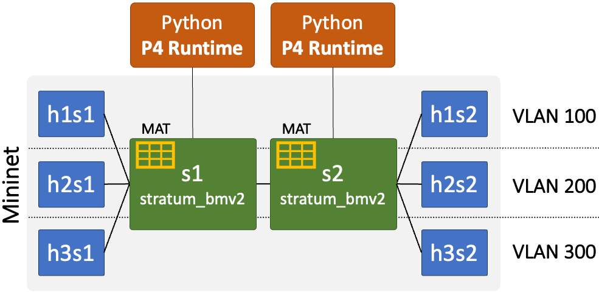
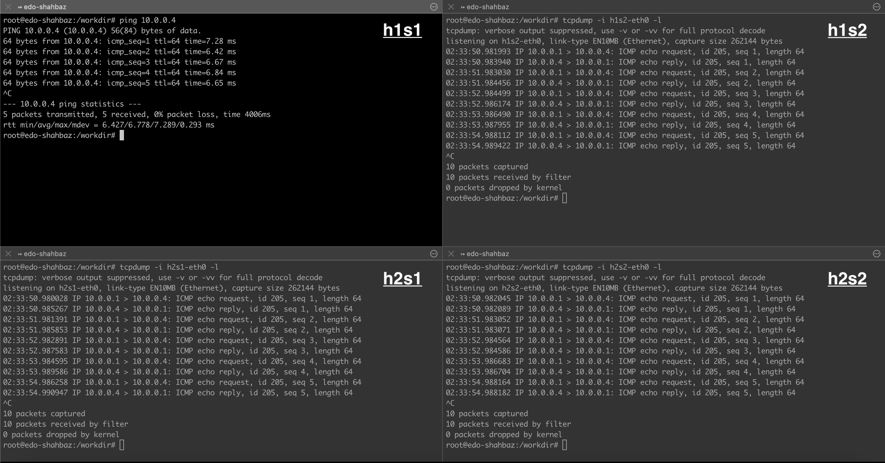
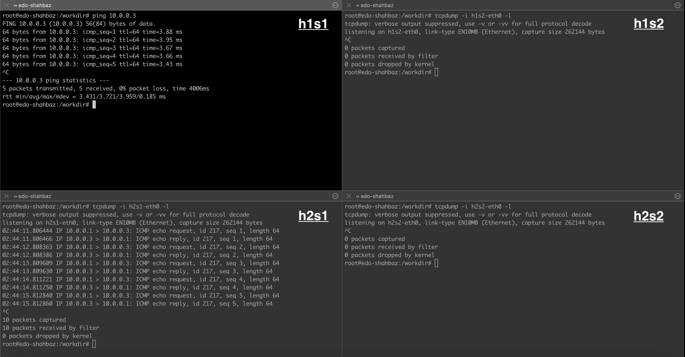

# Assignment 3: From Bridging to Switching using P4's Match-Action Tables (MATs)

In this assignment, we will look at how programmable network devices can help accelerate networking by executing parts of the communication logic directly in the data-plane hardware using match-action tables (MATs). We will extend [assignment2](../assignment2) and create a custom switch (using P4) that would forward packets in the data plane and use the control plane for learning (match-action) flow rules only. 

You will build and run your switch on an emulated Mininet network using P4 programmable switches and the P4 Runtime API.

> **NOTE:** You may work in a team of **TWO** if you would like (this is strongly suggested by not required; grading will only be based on your submission regardless of the size of the team).

## Getting Started

### Part A: Virtual environment and network topology

This assignment builds on [assignment0](../assignment0), so please ensure that you have a successfully working virtual environment. You will be building a slightly different network, as depicted in the following figure. It's similar to the one in [assignment2](../assignment2), but with match-action tables residing in the switches now.

<br>

- The example network consists of two switches (`s1` and `s2`) with six hosts (`h1s1`, `h2s1`, `h3s1`, `h1s2`, `h2s2`, and `h3s2`). You may consider it as a network with two segments: `h1s1`, `h2s1`, and `h3s1` forming one segment with `s1`, and `h1s2`, `h2s2`, and `h3s2` forming the other one with `s2`. Moreover, when VLAN is enabled, `h1s1` and `h1s2` form one virtual LAN (`100`), `h2s1` and `h2s2` form a second virtual LAN (`200`), and `h3s1` and `h3s2` form a third virtual LAN (`300`). **Note: your assignment will be graded against different topolgoies and not just the one shown here!**

- We will be using the [P4 language](https://p4.org/) to program the two network switches to implement the necessary logic (bridging or switching) for forwarding packets (e.g., drop or forward or broadcast). Moreover, unlike in [assignment2](../assignment2), this time packets will be matched and acted upon directly within the switch using the match-action tables (MATs), with flow rules configured by the control plane (read next).

  > **INFO:** The Programming Protocol-independent Packet Processors (P4) is an open-source, domain-specific language for modern network devices (programmable switches, SmartNICs, FPGA, and more). Since its inception in 2014, it has already gained wide traction and adoption from industry and academia alike (see more [here](https://p4.org/)).

- Instead of ONOS, we will be using the [P4 Runtime API](https://p4.org/p4-spec/p4runtime/main/P4Runtime-Spec.html) to write a custom Python-based controller to learn and update MAT rules in the network switches.
  > **INFO:** The P4 Runtime API is the same southbound API used by the ONOS controller when interacting with the P4 programmable switches (see more [here](https://www.youtube.com/watch?v=BE_y-Sz0WnQ)).

- We have also updated [`Makefile`](Makefile) to make it easier to run and test your assignment. You can type `make help` from the top directory to list an example usage of the necessary commands.

### Part B: A walkthrough of a learning bridge

Before implementing a learning switch in P4, let's take a walkthrough of the provided codebase using learning bridge as an exmaple. 

Recall that a simple bridge broadcasts each incoming packet to all ports, except the ingress port. A learning bridge optimizes on this simple bridge by dropping all packets that belong to the same segment. For example, in the topology earlier, if `h1s1` is communicating with `h2s1`, the switch `s2` will drop any such packets arrivng on its port connected to `s1`. It will do so, by maintaining a table that maps the source Ethernet address to the ingress port for each packet it sees. Then, for later packets, the switch looks up the table using their desitnation Ethernet address: if the port found is same as ingress port of the incoming packets, indicating that the desitnation resides on the same port the packets came in from, the switch drops such packets; otherwise, it broadcasts them as usual.

#### The learning bridge code

Previously, in [assignment2](../assignment2), the [`bridge.py`](assignments/assignment2/p4rt-src/bridge.py) script was implementing the entire logic of a learning bridge, including the table for filtering same-segment packets. Whereas, the [`bridge.p4`](assignments/assignment2/p4-src/bridge.p4) code was simply forwarding all incoming traffic from hosts to the Python runtime and traffic from the runtime to the hosts---it wasn't bridging the packets, itself.

This time, however, if you look at the [`bridge.p4`](assignments/assignment3/p4-src/bridge.p4) code under the `assignments/assignment3/p4-src` folder, it implements a table [`bridge_table`](assignments/assignment3/p4-src/bridge.p4#L102) that matches the destination Ethernet address and ingress port of the arriving packet. A successful match indicates that the destination host resides on the same port as the source host, and the bridge should therefore drop the packet. To do so, when broadcasting packets to egress ports, the bridge sends a copy of the packet to the Python runtime (or controller), [`bridge.py`](assignments/assignment3/p4rt-src/bridge.py). The controller learns the source Ethernet address and ingress port of the packet and installs a rule in `bridge_table` with a `drop` action. Next time, whenever the destination address and ingress port of a packet matches the table entry, it's dropped by the bridge.

> **NOTE:** Pay close attention to which Ethernet address is being used for learning and forwarding. When learning, the controller installs a flow rule with packet's source Ethernet address [`line 105`](assignments/assignment3/p4rt-src/bridge.py#L105). However, when forwarding, the bridge uses the packet's destination Ethernet address for lookup [`line 104`](assignments/assignment3/p4-src/bridge.p4#L104).

Please invest sometime going through the [`bridge.p4`](assignments/assignment3/p4-src/bridge.p4) and [`bridge.py`](assignments/assignment3/p4rt-src/bridge.py) code to understand their various components in detail. You will be working with similar functions when implementing your custom learning switch.

- **Bridging in P4** <br>The P4 code has the following main components:
  - **Header declarations, [`line 38`](assignments/assignment3/p4-src/bridge.p4#L38).** Defines the Ethernet and PacketIn header structures used by the bridge.
  - **Packet parsing, [`line 63`](assignments/assignment3/p4-src/bridge.p4#L63).** Parses the Ethernet header of each incoming packet, and forwards it to the ingress-processing stage. The ingress port is provided as part of the `standard_metadata` structure, which is pre-populated by the underlying data plane.
  - **Ingress processing, [`line 90`](assignments/assignment3/p4-src/bridge.p4#L90).** Implements `bridge_table` to match the destination Ethernet address and ingress port for filtering same-segment packets, as well as broadcast non-matching packets to all egress ports (including the controller port).
  - **Egress processing, [`line 124`](assignments/assignment3/p4-src/bridge.p4#L124).** Prunes broadcast packets going to the same ingress port, as well as sets the `packet_in` header to valid for packets going to the controller.
    > **INFO:** The egress-processing stage receives a separate copy for each of the port the packet is being broadcast to. For example, if a bridge has four ports, the egress-processing stage will receive four copies of the packet from the ingress stage when the broadcast/flood action is used.
  - **Packet deparsing, [`line 159`](assignments/assignment3/p4-src/bridge.p4#L159).** Seralizes packets' headers and body for departure. 
- **Learning in Python controller** <br>The [`ProcPacketIn()`](assignments/assignment3/p4rt-src/bridge.py#L74) function in `bridge.py` receives and processes all packets entering the controller. Compared to [assignment2](../assignment2), its logic is simple this time; it reads the source Ethernet address and ingress port from the packet and installs a rule in `bridge_table` on the data plane **[`line 104`](assignments/assignment3/p4rt-src/bridge.py#L104)**.

To see all this in action, please give it a try yourself!

<details><summary><b>Try it yourself! (Click Me)</b></summary>
<br>

- **Start the Mininet environment**. On a new terminal, run:
  ```bash
  $ cd assignments/assignment3
  $ make mininet topo=linear,2,3
  ```

  > **INFO:** The argument `topo=linear,2,3` tells Mininet to start the virtual environment with our example topology, above (i.e., two switches connected linearly with each having three hosts). You can verify this by running the `nodes` command from within the Mininet shell.
  > 
  > ```bash
  > mininet> nodes
  > available nodes are:
  > h1s1 h1s2 h2s1 h2s2 h3s1 h3s2 s1 s2
  > ```

  Notice, that Mininet now runs two switches each listening on their respective GRPC port for Python controller to connect to.
  ``` bash
  *** Starting 2 switches
  s1 ⚡️ stratum_bmv2 @ 50001
  s2 ⚡️ stratum_bmv2 @ 50002
  ```

- **Start learning bridge (Python controller) for each switch**.
  - Open a new terminal and connect to `s1` on port 50001
    ```bash
    $ make controller name=bridge grpc_port=50001 topo=linear,2,3
    ```
  - Open another terminal and connect to `s2` on port 50002 
    ```bash
    $ make controller name=bridge grpc_port=50002 topo=linear,2,3
    ```

  > **INFO**: The argument `name=bridge` specifies whether you are running a bridge or a switch, `grpc_port=50001` tells which grpc port to connect to, and `topo=linear,2,3` indicates the topology being used.

  Once running, you should see INFO messages started to print on the terminal. For example, here's a sample output for `s1`:
  ```bash
  Bridge Started @ Port: 50001
  Press CTRL+C to stop ...
  INFO: Log committed to logs/bridge-50001-table.json
  INFO: Log committed to logs/bridge-50001-table.json
  ```

  > **INFO:** 
  > - You can view current entries in the learning bridge table using, e.g., `make controller-logs name=bridge grpc_port=50001`.
  > - You can terminate the controller by pressing CTRL+C at any time.

- **Start `tcpdump` on `h2s1`, `h1s2`, and `h2s2`**.
  - In a new terminal, log into `h2s1` using `make host name=h2s1` and run:
    ```bash
    root# tcpdump -i h2s1-eth0 -l
    ```
  - Repeat the same step for the remaining two hosts `h1s2` and `h2s2`.

- **Let's ping `h2s2` from `h1s1` sitting across the two switches**.
  - In a new terminal, log into `h1s1` using `make host name=h1s1` and run:
    ```bash
    root# ping 10.0.0.4
    PING 10.0.0.4 (10.0.0.4) 56(84) bytes of data.
    64 bytes from 10.0.0.4: icmp_seq=1 ttl=64 time=11.3 ms
    64 bytes from 10.0.0.4: icmp_seq=2 ttl=64 time=5.43 ms
    ```
    > **INFO:** You can find the IP address of the host using the `ip address` or `hostname -I` commands. For example, from inside `h2s2`, run:
    > ```bash
    > # hostname -I
    > 10.0.0.4
    > ```
  - From the `tcpdump` output for `h2s1`, `h1s2`, and `h2s2`, you will see that all these hosts are receiving the ICMP echo request/reply packets, which is the right behavior as hosts (`h1s1` and `h2s2`) are sitting across switches in two different segments. Here's a sample output with all terminals displayed together.<br><br>
  <br>

- **Let's ping `h2s1` from `h1s1` sitting on the same switch**.
  - From `h1s1` terminal run:
    ```bash
    root# ping 10.0.0.3
    PING 10.0.0.3 (10.0.0.3) 56(84) bytes of data.
    64 bytes from 10.0.0.3: icmp_seq=1 ttl=64 time=3.88 ms
    64 bytes from 10.0.0.3: icmp_seq=2 ttl=64 time=3.95 ms
    ```
  - This time, from the `tcpdump` output for `h2s1`, `h1s2`, and `h2s2`, you will see that only `h2s1` is receiving the ICMP echo request/reply packets. The learning bridge is succesfully filtering packets destined to hosts in the same segment. Here's a sample output with all terminals displayed together.<br><br>
  <br>
</details>

### Part C: Building a learning switch with VLAN

Now, let's jump into the most interesting part of the assignment, which is to build your own custom layer-2 learning switch with VLAN support using P4. 

Again, recall that a learning switch is another optimization on top of a learning bridge. Instead of filtering packets belonging to the same segments, a layer-2 switch learns and maintains information about the ports to which the different hosts are connected to. And, whenever a packet comes in for a particular host, rather than blindly broadcasting packets, the switch instead looks up the stored information and forwards the packet directly on a port leading to the destination host. The switch gradually learns about the existence of various hosts connected on the network by intercepting ARP packets and maintaining a table that maps source Ethernet addresses to ingress ports.

> **INFO:** The table in a learning switch seems quite similar to that of a learning bridge; however, it's role is quite different. Rather than filtering packets belonging to the same segments in a bridge, it's used to find out the exact target port of the destination host in the learning switch.

Virtual LAN (or VLAN) is a feature that extends a learning switch to configure two or more completely separate networks on top of a single switch or network of switches. For example, in our example topology above, `h1s1`/`h1s2`, `h2s1`/`h2s2`, and `h3s1`/`h3s2` form three completely separate networks. With VLAN, these three networks can now be implemented using the same switches `s1` and `s2`, rather than having three different physical peer-to-peer links.

#### The learning switch (with VLAN) code

The [`p4rt-src/switch.py`](assignments/assignment3/p4rt-src/switch.py) script and [`p4-src/switch.p4`](assignments/assignment3/p4-src/switch.p4) code under the `assignments/assignment3` folder provide the scaffolding for a learning switch. Please make sure to read and understand them carefully before starting to program. You should program only in the locations of the provided script and code marked with `TODO` comments. There are seven `TODO` sections in total: four for the `switch.p4` code and three for the `switch.py` script. In `switch.p4`, you have to implement the switch table and apply block ([control-flow graph](https://en.wikipedia.org/wiki/Control-flow_graph)) for the ingress-processing stage, and the VLAN table and apply block for the egress-processing stage (read below). In `switch.py`, you have to add code for installing switching and VLAN rules in the data plane. You can add functions and blocks if you wish, but do not change the script/code or any other file name, as they will be used for automated testing. 

As in the case of the learning bridge, the switch will now forward packets within the data plane and learn rules from the control plane using the [`switch.p4`](assignments/assignment3/p4-src/switch.p4) code and [`switch.py`](assignments/assignment3/p4rt-src/switch.py) script, respectively.

- **Switching in P4** <br> The fowarding logic takes place in the ingress-processing stage and VLAN pruning happens in the egress-processing stage. In the `switch.p4`, you need to complete the code for the following:
  - **Ingress processing.** Add the switching table **[`line 132`](assignments/assignment3/p4-src/switch.p4#L132)** and complete the apply block (i.e., its [control-flow graph](https://en.wikipedia.org/wiki/Control-flow_graph)) **[`line 160`](assignments/assignment3/p4-src/switch.p4#L160)**.
    - The switching table should match the destination Ethernet address of the arriving packet as well as its VLAN ID. Based on the outcome of the match, it should either forward the packet to the right egress port or broadcast it.
    - The apply block should check if its an ARP packet. If so, it should broadcast the packet; otherwise, process it through the switching table.
  - **Egress processing.** Add the VLAN table **[`line 207`](assignments/assignment3/p4-src/switch.p4#L207)** and complete the apply block **[`line 234`](assignments/assignment3/p4-src/switch.p4#L234)**.
    - The VLAN table should match the egress port and VLAN ID of the packet to find out if it matches that of the egress port. If so, it should let the packet pass through; otherwise, drop it.
    - The apply block should check for the following:
      - Prune any packets that are going back out on the port they came in from (i.e., the ingress port).
      - Add `packet_in` header to ARP packets going to the controller.
      - Check if the packet's VLAN ID matches that of the egress port using the VLAN table.
  > **INFO:** 
  > - Please follow [`p4-src/bridge.p4`](assignments/assignment3/p4-src/bridge.p4) code for a reference example on how to create a table in P4, [`line 102`](assignments/assignment3/p4-src/bridge.p4#L102). 
  > - For a deeper dive, read the P4 language specification ([link](https://p4.org/p4-spec/docs/P4-16-v1.2.2.html#sec-tables)). Specifically, we are using [P4-16](https://p4.org/p4-spec/docs/P4-16-v1.2.2.html) with [v1model](https://github.com/p4lang/p4c/blob/main/p4include/v1model.p4).
- **Learning in Python controller** <br> The learning takes place in the controller. In `switch.py`, you need to add code for the following:
  - For each ARP packet, install a rule in the switching table **[`line 117`](assignments/assignment3/p4rt-src/switch.py#L117)** that you created in P4, above. 
    - Match fields: source Ethernet address and VLAN ID. 
    - Action: `forward`, with the ingress port as parameter.
  > **INFO:** Please follow [`p4rt-src/bridge.py`](assignments/assignment3/p4rt-src/bridge.py) code for a reference example on how to install flow rules, [`line 104`](assignments/assignment3/p4rt-src/bridge.py#L104). You can pass action parameters (like ingress port) using the action object of the TableEntry class. For example, ... (add it before the insert function)
  > ```python
  > table_entry.action['port'] = str(ingress_port) 
  > table_entry.insert()
  > ```
  - Install VLAN rules at startup under the `__main__` block **[`line 206`](assignments/assignment3/p4rt-src/switch.py#L206)**. 
    - Match fields: egress port and VLAN ID.
    - Action: `noop`
  - Delete the VLAN rules upon exit **[`line 251`](assignments/assignment3/p4rt-src/switch.py#L251)**. 

> **INFO:** The reference solution has roughly **50** and **30** (well commented and spaced) lines of code in the seven total `TODO` sections of the `switch.p4` code and `switch.py` script, respectively.

Once you have completed the script, give it a try!

<details><summary><b>Try it yourself! (Click Me)</b></summary>
<br>

- **Start the Mininet environment**. On a new terminal, run:
  ```bash
  $ cd assignments/assignment3
  $ make mininet topo=linear,2,3
  ```

- **Start learning switch (Python controller) for each switch**.
  - Open a new terminal and connect to `s1` on port 50001
    ```bash
    $ make controller name=switch grpc_port=50001 topo=linear,2,3
    ```
  - Open another terminal and connect to `s2` on port 50002 
    ```bash
    $ make controller name=switch grpc_port=50002 topo=linear,2,3
    ```

- **Start `tcpdump` on `h2s1`, `h1s2`, and `h2s2`**.
  - In a new terminal, log into `h2s1` using `make host name=h2s1` and run:
    ```bash
    root# tcpdump -i h2s1-eth0 -l
    ```
  - Repeat the same step for the remaining two hosts `h1s2` and `h2s2`.

- **Let's ping `h2s2` from `h1s1` sitting across the two switches (without VLAN)**.
  - In a new terminal, log into `h1s1` using `make host name=h1s1` and run:
    ```bash
    root# ping 10.0.0.4
    PING 10.0.0.4 (10.0.0.4) 56(84) bytes of data.
    64 bytes from 10.0.0.4: icmp_seq=7 ttl=64 time=5.40 ms
    64 bytes from 10.0.0.4: icmp_seq=8 ttl=64 time=5.68 ms
    ```
  > **NOTE:** Wait for the ping; it may take another round of ARP requests between hosts for it to start. The hosts might have an existing cache entry from a previous run, but the switches haven't seen any ARP packet yet.
  - From the `tcpdump` output for `h2s1`, `h1s2`, and `h2s2`, you should see that only `h2s2` is receiving the ICMP echo request/reply packets, which is the expected behavior. 
  - You should see the same behavior when pinging between any two pairs of these hosts.

- **Let's ping `h2s2` from `h1s1` sitting across the two switches (with VLAN)**.
  - In a separate terminal, run the following command to enable VLAN (make sure Mininet and controllers are running):
  ```bash
  $ cd assignments/assignment3
  $ make enable-vlan topo=linear,2,3
  ```
  > **INFO:** You can disable VLAN anytime by running `make disable-vlan topo=linear,2,3`.
  - Once VLAN is enabled, the switches will start receiving packets from hosts with a VLAN header attached (containing the respective VLAN ID).
  - Log back into `h1s1`, using `make host name=h1s1`, and run:
  ```bash
    root# ping 10.0.0.4
    PING 10.0.0.4 (10.0.0.4) 56(84) bytes of data.
    From 10.0.0.1 icmp_seq=1 Destination Host Unreachable
    From 10.0.0.1 icmp_seq=2 Destination Host Unreachable
    ```
  - You should not be able to ping `h2s2` from `h1s1` as they reside in different VLANs now.
  - Only `h1s1` and `h1s2` can ping each other as they are in the same VLAN (100); same for `h2s1` and `h2s2` in VLAN (200).
</details>

> ---
> ### Useful hints
> 
> Here are some useful tips. If you are still having trouble, ask a question on [Campuswire](https://campuswire.com/c/G7E058110) or see an instructor during office hours.
> - There are various constants in the scaffolding code. Use them. If they are not defined in a particular file, you don't need them. If you are not using one of them, either you have hard-coded a value, which is bad style, or you are very likely doing something wrong.
> - Use the `ip address` or `hostname -I` commands from within a Mininet host to find the IP address of that host.

> ### Q&A
> 
> - **Where should I look to learn more about the P4 language?**<br>
> The [p4.org](https://p4.org/) website maintains the official [P4 language specifications](https://p4.org/specs/) and various [tutorial handouts](https://p4.org/learn/). Specifically, we are using [P4-16](https://p4.org/p4-spec/docs/P4-16-v1.2.2.html) with [v1model](https://github.com/p4lang/p4c/blob/main/p4include/v1model.p4). You may find this P4-16 code example useful, [demo1-heavily-commented.p4_16.p4](https://github.com/jafingerhut/p4-guide/blob/master/demo1/demo1-heavily-commented.p4_16.p4); it lists detailed documentation for the various components of a P4 program.
> - **Do I need to handle IPv6 traffic (i.e., ICMP6 discovery packets and more)?**<br>
> No. You only need to handle IPv4 traffic. We will evaluate your assignment against IPv4 packets only.
> - **I am seeing the following error when running the assignment: `docker: write /var/lib/docker/tmp/GetImageBlob979005397: no space left on device.` What should I do?**<br>
> Please prune the existing volumes using the folowing command: `docker system prune --all --force --volumes`
> ---

## Submission and Grading
Submit the assignment by uploading your modified `switch.p4` code and `switch.py` script to [Brightspace](https://purdue.brightspace.com/d2l/le/content/599158/viewContent/11340554/View).
You can submit as many times as you like before the deadline, but we will only take the last submission.

We will grade your assignments by running the `switch.p4` code and `switch.py` script against additional topologies with varying number of switches and hosts. Double-check the specifications above and perform your own tests before submitting them.

Code that does not compile is graded harshly; if you want partial credit on code that doesn't compile, comment it out and make sure your file compiles!

## Acknowledgement

This assginment would not have been made possible without the amazing works of many opensource contributors of Mininet, P4 Runtime API, and more. Special thanks to [Open Networking Foundation (ONF)](https://opennetworking.org/) for maintaining these codebases and making them opensource for the broader research community to use and innovate on!
